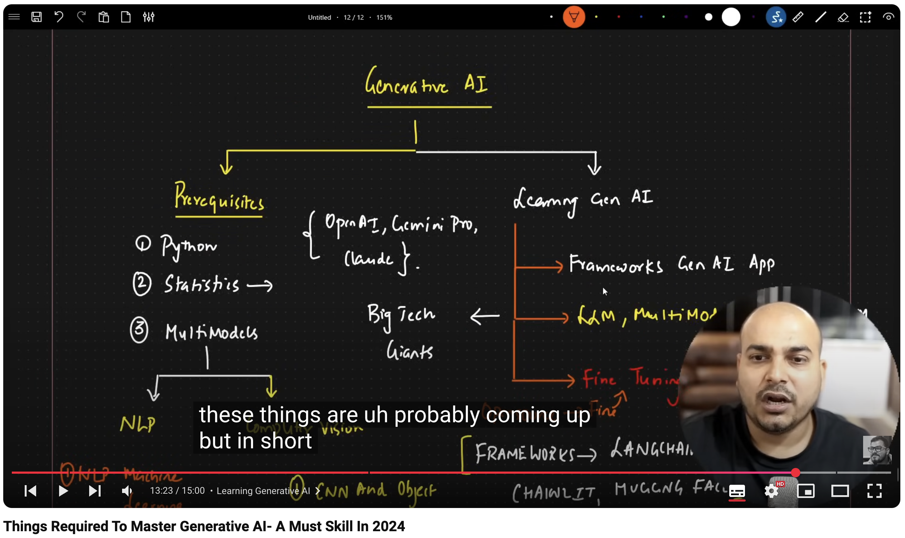
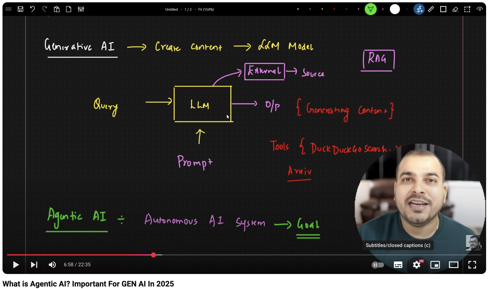

# Tech
concepts, frameworks, tools

# Difference between models

https://youtu.be/FooC7gp4wk4?t=328

- 05:28 ChatGPT-3 (Nov22)
- 05:34 ChatGPT-4 (Mar23)
- 05:40 ChatGPT-4o (May24) Multimodal of gpt-4
- 05:58 o1 model (Sep24) Chain of Thought (Advanced Reasoning Models)

# Concepts

## GenAI
Krish Naik - [Things Required To Master Generative AI- A Must Skill In 2024](https://youtu.be/HEHUpBO8UVc?list=PLA1lVIthbM1D5I6r5uY2K89X1KD2w5LNh)

## RAG
Krish Naik - [What is Agentic AI? Important For GEN AI In 2025](https://youtu.be/xOS0BhhdUbo?t=270)

### ChatGPT 3.5 in [Savvy](https://docs.google.com/document/d/1cAYB_hRuZOD9TBVNiuQNsw_vnmTUAY8ifTa0kiQsqzk)

#### Moderations Api
https://api.openai.com/v1/moderations

https://platform.openai.com/docs/api-reference/moderations/create

#### Chat Completions Api

https://api.openai.com/v1/chat/completions

