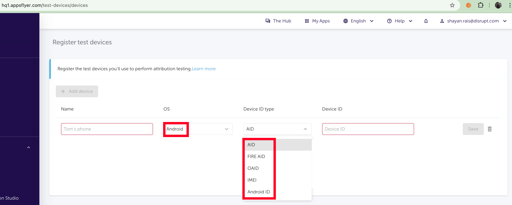
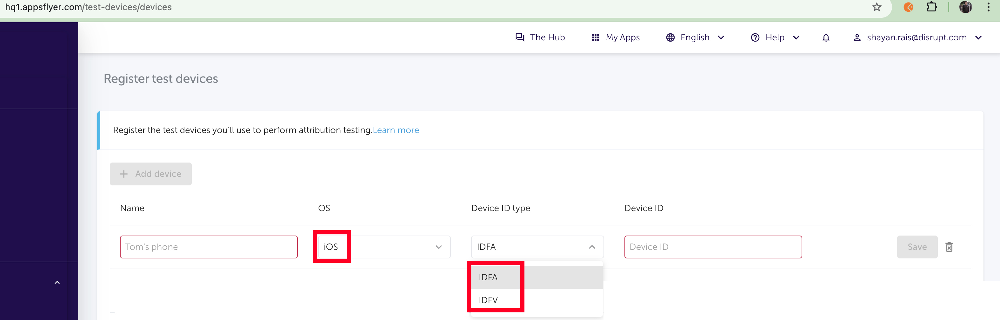
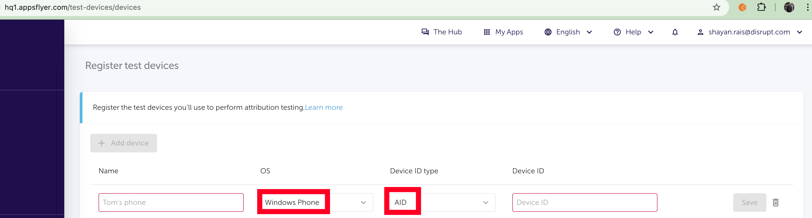

# Analytics, Data, Stat
everything about data, 
some images related these CRM dashboards are also available on [Push](/App/Push/README.md)

## [Adjust](Adjust)
- [10.9.0 Adjust Document](https://docs.google.com/document/d/1o4W9hWqjEqSRYWCJ2yGxwleZzpXG2BA6FxYBy_IZVMg/edit#heading=h.qv5tuf5lkyjv)
- Dashboard -> https://suite.adjust.com/datascape/report
- track device based on gps_adid(android), idfa(ios) , oaid(huawei)
- event management (properties cannot be viewed on dashboard, but need to download raw data)

## [Airship](Airship)
- [Dashboard](https://go.airship.com/apps/TDTGyqSbQyq4XHajj62UrA/contact_management/channel/35145b1c-b746-444b-a8e0-026c4473f5fe)
- track user + event management

## [Appsflyer](Appsflyer)
- event management (properties cannot be viewed on dashboard, but need to download raw data)
- [Live events tracking](https://support.appsflyer.com/hc/en-us/articles/207031996-Registering-test-devices#register-a-device-using-the-appsflyer-device-id-app-admin-only)
Android(AID {GAID or OAID}, IMEI, Android ID) ■ iOS(IDFA, IDFV) ■ Windows Phone(Windows advertising ID)

## [Firebase / GA4](Firebase)
- [Dashboard](https://console.firebase.google.com/u/1/project/savyour-test/analytics/app/ios:com.disrupt.savyour/events/)
- event management

## [Facebook](Facebook)
- [Dashboard](https://www.facebook.com/events_manager2/overview)
- [Facebook Conversion Api](https://www.youtube.com/watch?v=Tqb9GcHlAfk)
> After Apple rolled out the IOS 14.5 updates with updated Privacy Policy, Facebook was not longer able to track the user activities of people who opt out of the tracking.
But to stay in business Facebook came up with a new way of tracking which is known as Conversion API.

## [Mixpanel](Mixpanel)
- [Dashboard](https://mixpanel.com/project/1305204/view/20473/app/users)
- track user + event management
- events can be viewed with properties

## [MoEngage](MoEngage)
- [Convex Document](https://docs.google.com/document/d/1FgRO8P9BUZEXUOCQfTN1m5EoogzNcWPakogHs9H6fww/edit#heading=h.u6fin22lpwu7)
- Dashboard - https://dashboard-03.moengage.com/v4/#/developers/activity
- track user + event management
- events can be viewed with properties
