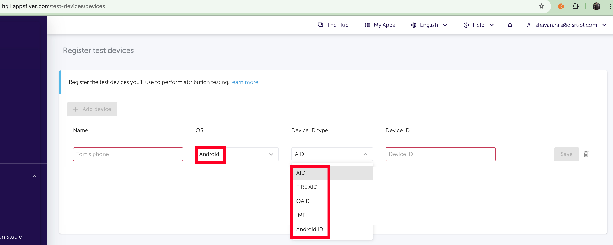

# Appsflyer
user identification ❌✅, event tracking  ✅

# USER IDENTIFICATION
appsflyer identification works different from moengage and mixpanel

Platform	|Email for User Identification
-|-
AppsFlyer	|Indirectly (via custom customer_user_id)
MoEngage	|Directly (primary identifier for engagement)
Mixpanel	|Directly (custom identifier for analytics)

### Ids used by appsflyer

Android(AID {GAID or OAID}, IMEI, Android ID) ■ iOS(IDFA, IDFV) ■ Windows Phone(Windows advertising ID)

# LIVE TRACKING
you can view the live events of the live app device

1. Select Live App
2. In side menu, goto Settings->Test Devices->Add Android AID (Device Settings->Privacy->Ads->Bottom of screen)
3. Goto SDK Integration Tests -> Select Live Events
4. Start
