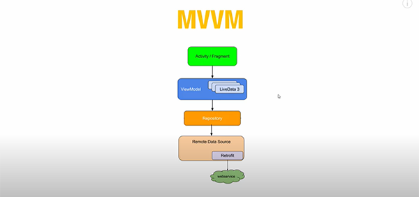

# Architecture

## MVVM

### Tutorial Followed

|Name|Link|Date
|:-:|:-:|:-:
|Cheezy Code|[Android Notes App Last Video - Improvements & Suggestions](https://www.youtube.com/watch?v=CEifFyzYfSI)|2/Jul/2022
|Philip Lackner|[How to Make a Clean Architecture Note App (MVVM / CRUD / Jetpack Compose)](https://www.youtube.com/watch?v=8YPXv7xKh2w)|22/Sep/2021
|Philip Lackner|[How to Make a Clean Architecture Cryptocurrency App (MVVM, Use Cases, Compose)](https://www.youtube.com/watch?v=EF33KmyprEQ)|7/Sep/2021


## MVP to MVVM
|Name|Link|Date
|:-:|:-:|:-:
|Philip Lackner|[VM classes are directly coupled to UI. In MVP, ViewModel is basically a Presenter](https://youtube.com/watch?v=8YPXv7xKh2w?t=2877)|22/Sep/2021
|Florina|[Should I switch to MVVM from MVP](https://youtube.com/watch?v=Ts-uxYiBEQ8&t=549s) / [Stackoverflow](https://stackoverflow.com/a/46763456/4754141)|6/Sep/2017

### Book Example
Type|MVP|MVVM|
|:-:|:-:|:-:|
Model (BookRepository) | getBooks() | getBooks()
View (BookActivity) | init (presenter, repository) ■ presenter.loadBook() ■ updateBookUI() | init (viewModel, repository) ■ viewModel.loadBook() • viewModel.liveData.observe() ■ updateBookUI()
Presenter (BookPresenter) • ViewModel (BookViewModel)| constructor(view, repository) ■ repository.getBooks() • view.updateBooksUI() | constructor(repository) ■ init (liveData) ■ repository.getBooks()
Advantages|separates application logic from UI • unit testing| ➕ view not bound • life-cycle aware (screen orientation)

## MVVM

### View (BookActivity)
```
class BookActivity : AppCompatActivity() {

    private lateinit var bookViewModel : BookViewModel

    override fun onCreate(savedInstanceState: Bundle?) {
        val bookRepository = BookRepositoryImpl()
        val factory = BookViewModelFactory(bookRepository)
        bookViewModel = ViewModelProviders.of(this,factory)[BookViewModel::class.java]
        lifecycleScope.launch {
            bookViewModel.booksLiveData.observe(this@BookActivity) { updateBooksUI() } //live data
        }
        //lifecycleScope.launch {
        //    bookViewModel.booksFlow.collectLatest { updateBooksUI() } //flow
        //}
        bookViewModel.loadBooks()
    }

    fun updateBooksUI() {}
```
### ModelView (BookViewModel)
```
class BookViewModel (private val bookRepository: BookRepository) : ViewModel() {

    val booksLiveData = MutableLiveData<Unit>()
    //val booksFlow = MutableSharedFlow<Unit>()
    
    fun loadBooks() {
        viewModelScope.launch {
            val response = bookRepository.getBooks()
            booksLiveData.value = response //using live data
            //booksFlow.emit(response) //using flow
        }
    }
}
```
### Model (BookRepository)
```
interface BookRepository {
    suspend fun getBooks()
}
```


### [Cheezy Code Implementation](https://youtube.com/watch?v=8ZLbv6TSa-U?list=PLRKyZvuMYSIMO2ebTldbwMTnDCn5klzjS&t=71)



