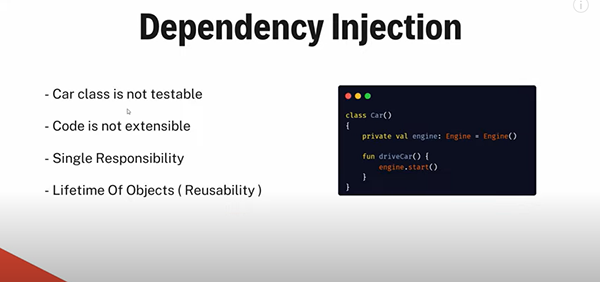
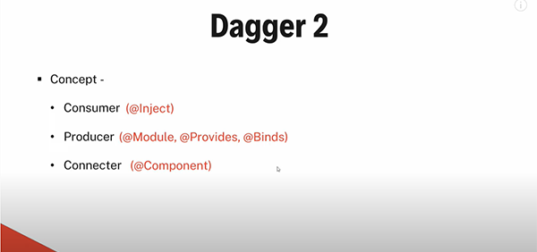
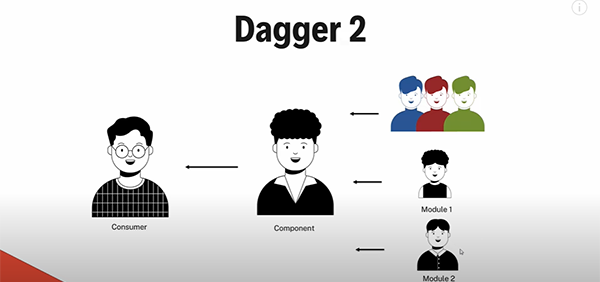

# Dependency Injection
dagger, hilt, koin

```
do not create hardcode 'Engine' object inside a 'Car', instead pass all dependencies ('Engine') as parameters
```

[How to explain dependency injection to a 5-year-old?](https://stackoverflow.com/q/1638919/4754141)

### Tutorial Followed
|Name|Link|Date|
|:-:|:-:|:-:
|Cheezy Code|[What is Dependency Injection? Tutorial - CheezyCode (Hindi) #1](https://www.youtube.com/watch?v=DtzQkBp2M5M&list=PLRKyZvuMYSIPwjYw1bt_7u7nEwe6vATQd)|1/Feb/2022

### Examples
|Name|Example|Library|Link|Date|
|:-:|:-:|:-:|:-:|:-:
|Cheezy Code|API + AuthInterceptor + TokenManager(Prefs)|Hilt|[Android Notes App with API - HILT & Retrofit](https://www.youtube.com/watch?v=8ZLbv6TSa-U&list=PLRKyZvuMYSIMO2ebTldbwMTnDCn5klzjS)|[8/June/2022](https://github.com/CheezyCode/YetAnotherNotesApp)
|Cheezy Code|API + Database + Analytics|Dagger2|[Dagger 2 Concepts Revisted, Component Dependencies #10](https://youtube.com/watch?v=szs80OgMsy8?list=PLRKyZvuMYSIPwjYw1bt_7u7nEwe6vATQd&t=296)|[19/Feb/2022](https://github.com/CheezyCode/Dagger2-Examples)


### [Why Dependency Injection?](https://youtube.com/watch?v=DtzQkBp2M5M?list=PLRKyZvuMYSIPwjYw1bt_7u7nEwe6vATQd&t=146)



|#|Types Of Injection|
|:-:|:-:|
|1|Constructor Injection|
|2|Field Injection|

# DAGGER 2
[Dagger ko aap 1 programmer samjh saktay ho, jo aap ki madad karta hai 1 acha code likhnay mein](https://youtube.com/watch?v=cg0yCHW2Keg&t=130)

[Concept](https://youtube.com/watch?v=cg0yCHW2Keg&t=139)




# HILT

### Migration Steps (Dagger 2 to Hilt) 

1. Application -> @HiltAndroidApp
2. All Activities/Fragments/Service -> @AndroidEntryPoint
3. Repository -> @Inject constructor
4. RemoteDataSource -> @Inject constructor
5. for abstract class/interface (ApiClass) -> create module class and provide methods

### Issues

1. Inject Pref inside object class (AppLifecycleListener, DynamicLink) ■ [@Inject annotation is available only for EntryPoints like @AndroidEntryPoint, @HiltAndroidApp. As of now, there is no option to inject into a non-entry point classes in Hilt](https://stackoverflow.com/a/67171565/4754141) ■ [Solution](https://write.agrevolution.in/dependency-injection-in-android-using-hilt-part4-e2b267839e12)


