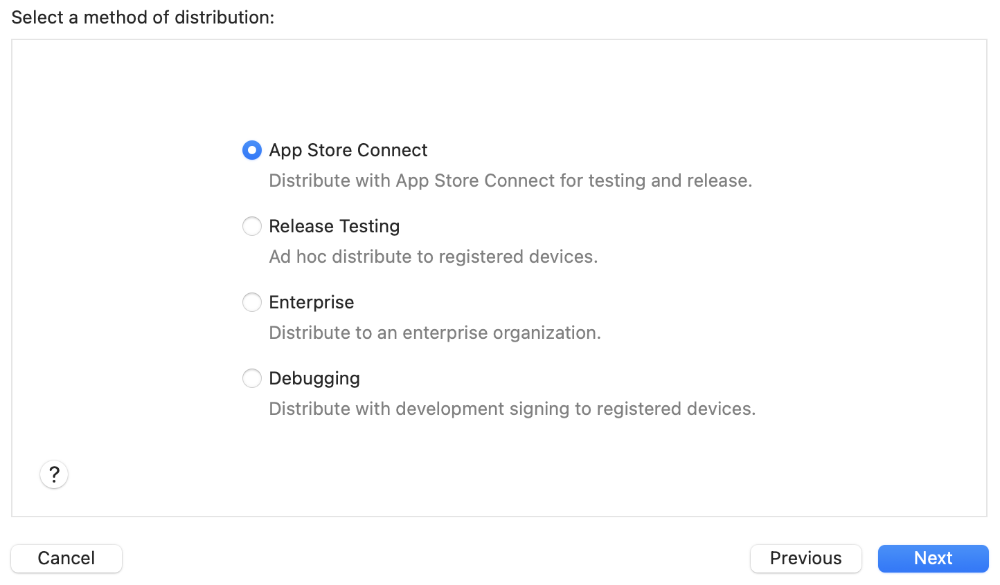
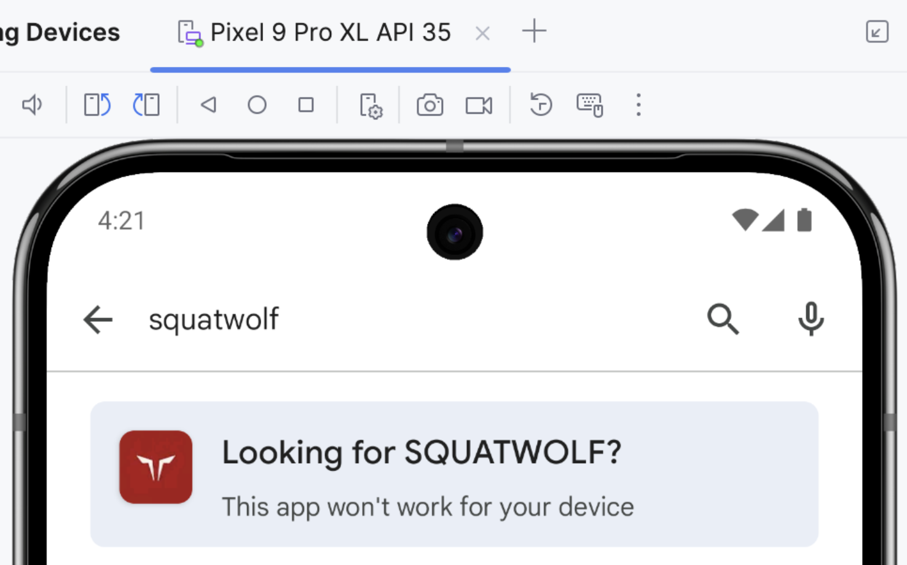
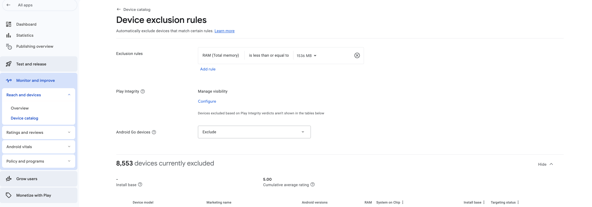

# CI/CD, Build Distribution, Deployment

# ■ BUILD DISTRIBUTION

## ANDROID
### Internal Testing [Google Review Required: ❌]
Requirements: any email, upto 100 testers

### Closed Testing (Alpha) [Google Review Required: ✅]
Requirements: any email, upto 400k testers, rollout in % avb

### Open Testing (Beta) [Google Review Required: ✅]
Requirements: any email, atleast 1000 testers, rollout in % avb

## IOS
### Diawi (Internal Tester) [Apple Review Required: ❌]
Requirements: Idfa/Uuid (no need to add user) -> Certificates, IDs & Profiles -> Devices,

### Testflight (Internal Tester) [Apple Review Required: ❌]
Requirements: icloud email (invite 1) -> then invite user to testflight (only added accounts can be invited) [overall 2 invitation]

### Testflight (External Tester - Public Link) [Apple Review Required: ✅]
needs apple approval on testflight

# ■ BUILD GENERATION

## IOS

1. Set the destination to Generic iOS Device (Product > Destination > Generic iOS Device).
2. Product -> Archive
3. Window -> Organize
4. Distribute App (4 options)

### Diawi - #2 - Release Testing (Old Name = Adhoc)

1. MoEngage events will trigger on prod
2. React Native __DEV__ == false

**ENTITLEMENTS**
1. get-task-allow = false
2. aps-environment = production

### Diawi - #4 - Debugging (Old Name = development)

Although its a debugging build, but its has few issues
1. MoEngage events will trigger on prod
2. MoEngage Push (both stag/prod) wont work
3. React Native __DEV__ == false

**ENTITLEMENTS**
1. get-task-allow = true
2. aps-environment = development

# ■ APP NOT AVAILABLE
app not available on certain devices

## ANDROID

Android Go Devices are excluded

