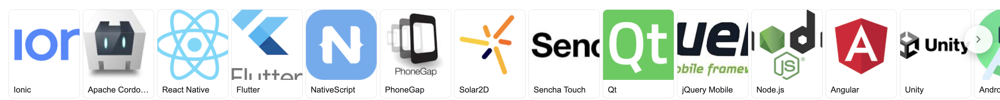

# Hybrid (+Cross Platform) ✝️
different cross platform technologies

### ➼ [Flutter](Flutter)
### ➼ [React Native](ReactNative)

# DIFFERENT TECHNOLOGY

#|Technologies|Languages
:-:|:-:|:-:
1|React Native|Javascript
2|Flutter|Dart
3|Ionic|Typescript
4|Titanium|Javascript
5|Phone Gap|Javascript
6|Unity3D|C#, Javascript
7|Apache Cordova|Javascript

## Other Options

1. PWA (Progressive Web Apps): Built with HTML, CSS, JavaScript. Frameworks like Angular, React, or Vue enhance development.
2. Webview App
3. KMP-Kotlin Multiplatform (old name = KMM) [business logic sharing] with [CMP-Compose Multiplatform](https://blog.jetbrains.com/kotlin/2025/05/compose-multiplatform-1-8-0-released-compose-multiplatform-for-ios-is-stable-and-production-ready/) [ui sharing]

## Apps Tech Stack

Date|Technologies|Link
-|-|-
06/May/25|Compose Multiplatform|[Compose Multiplatform 1.8.0 Released: Compose Multiplatform for iOS Is Stable and Production-Ready](https://blog.jetbrains.com/kotlin/2025/05/compose-multiplatform-1-8-0-released-compose-multiplatform-for-ios-is-stable-and-production-ready/)
17/Jan/25|Flutter v React Native|[React Native vs Flutter: What to Choose in 2025](https://www.browserstack.com/guide/flutter-vs-react-native)
14/Jan/25|Flutter v React Native|[Cross-platform mobile development - pragmaticengineer](https://newsletter.pragmaticengineer.com/p/cross-platform-mobile-development)
04/Feb/25|React Native (Expo)|[Cross-platform mobile development with Expo - pragmaticengineer](https://newsletter.pragmaticengineer.com/p/expo)
18/Feb/25|Hiring Market|[State of the startup and scaleup hiring markets in 2025 – as seen by recruiters - pragmaticengineer](https://newsletter.pragmaticengineer.com/p/startup-market-in-2025)
22/Mar/23|React Native + Native|[Instagram's tech stack will surprise you](https://www.youtube.com/watch?v=ODKzJrrHua0)
19/Jul/18|React Native to Native|[Why did Airbnb decide to revert back to native apps from React Native?](https://www.quora.com/Why-did-Airbnb-decide-to-revert-back-to-native-apps-from-React-Native)

