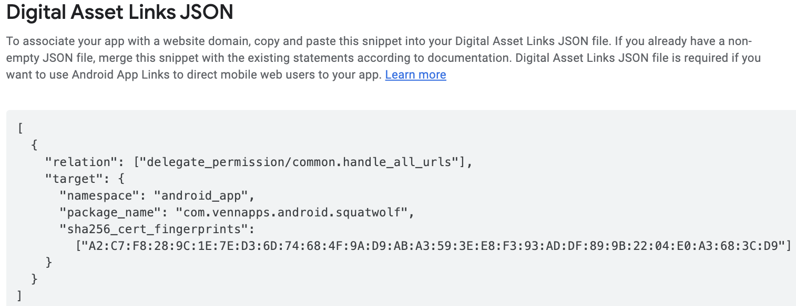
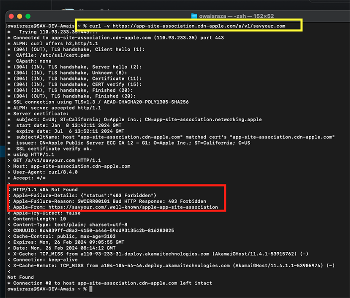

# Link
linking much?

## Asset Links vs Apple App Site Association

https://savyour.com.pk/.well-known/apple-app-site-association

https://ps43.adj.st/.well-known/apple-app-site-association

https://savyour.com.pk/.well-known/assetlinks.json

### Examples
 Daraz | [Android](https://daraz.pk/.well-known/assetlinks.json) | [iOS](https://daraz.pk//.well-known/apple-app-site-association)

### Android assetlinks.json 
this file can also be downloaded from playstore
Playstore App -> Test and Release -> Setup -> App Signing (Digital Asset Links JSON)

### Apple issue (403)
403 - forbidden when apple bot is trying to crawl ([24 hours, once per week](https://developer.apple.com/documentation/xcode/supporting-associated-domains))

- File is present on https://savyour.com/.well-known/apple-app-site-association
- But not showing on https://app-site-association.cdn-apple.com/a/v1/savyour.com 

Open terminal, type
> curl -v https://app-site-association.cdn-apple.com/a/v1/savyour.com

### Validate these files (invalid content type issue)

https://yurl.chayev.com/ios-results?url=https%3A%2F%2Fsavyour.com.pk

https://branch.io/resources/aasa-validator/

## Platforms
1. [Android App Links](Android)
2. [Adjust Deep Link](Adjust)
3. [Appsflyer OneLink](Appsflyer)
4. [Facebook Deep Link](Facebook)
5. [Firebase Dynamic Link](Firebase)

## Defaults
Settings -> Apps -> Manage Apps -> Default Apps -> Opening Links -> Savyour (Open Supported Links)

[set default](Default)

## Multi Site
examples

1. domain (shopback.sg)
2. sub domain (en-ae.pg.com/)
3. directory (noon.com/uae-en/)

### 1) domain

|Examples|
|---|
|https://www.shopback.sg/|
|https://www.shopback.com.tw/|
|https://www.shopback.de/|

### 2) subdomain

|Examples|
|---|
|https://en-ae.pg.com/|
|https://ar-eg.pg.com/|

### 3) directory

|Examples|
|---|
|https://www.noon.com/saudi-ar/|
|https://www.noon.com/uae-en/|
|https://www.saudia.com/en-PK/booking|

