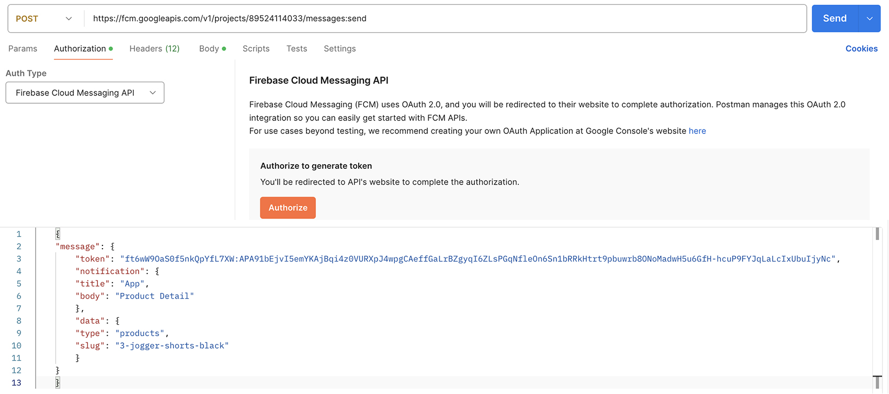

# Firebase Cloud Messaging (FCM)

## Send Push using Postman
- Download key-firebase-adminsdk-fbsvc-4aeee158f6.json (private key) from firebase console and run following in terminal
- Use printed token in firebase (valid for 1 hour only)

```
brew install --cask google-cloud-sdk
gcloud init
gcloud auth activate-service-account --key-file=key-firebase-adminsdk-fbsvc-4aeee158f6.json
gcloud auth print-access-token
```

- or simply use firebase auth in postman (authentic user with project access is required - valid for 1 hour only)


