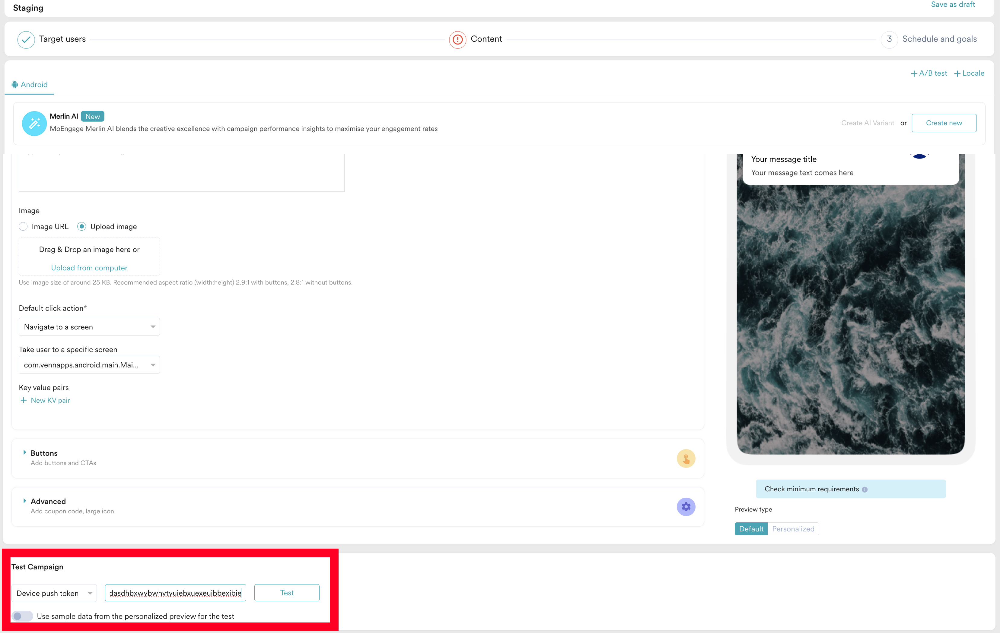

# MoEngage Push Notification


## Dashboard (Test Push)

send test push notification from

1. Menu->Engage->Campaign (https://dashboard-02.moengage.com/v4/#/campaigns/all)
2. Create Campaign->Push->One Time



## Payload

payload is different from FCM, check from key `push_from` and map `gcm_title` and `gcm_alert`
```
{
  originalPriority: 2,
  priority: 2,
  sentTime: 1744982953270,
  data: {
    gcm_title: 'FCM TITLE',
    gcm_campaign_id: '000000000000000079899852_L_0',
    gcm_alert: 'FCM MESSAGE',
    moe_push_service: 'fcm',
    push_from: 'moengage',
    moe_channel_id: 'moe_default_channel',
    moe_cid_attr: '{"moe_campaign_channel": "Push", "moe_delivery_type": "One Time", "campaign_version_no": 1, "moe_campaign_id": "000000000000000079899852", "sent_epoch_time": 1744982953}',
    moe_app_id: 'RPZ3I8PIPNOW0RZLQRNTAKMU_DEBUG',
    gcm_notificationType: 'normal notification',
    gcm_activityName: 'com.android.main.MainActivity'
  },
  from: '819811173704',
  messageId: '0:1744982953280018%37d032bc49efb69d',
  ttl: 129600,
  collapseKey: '000000000000000079899852_L_0'
}
```


